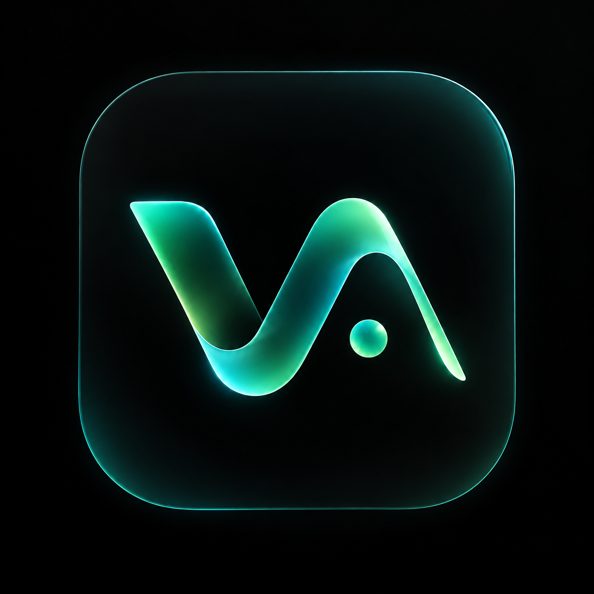
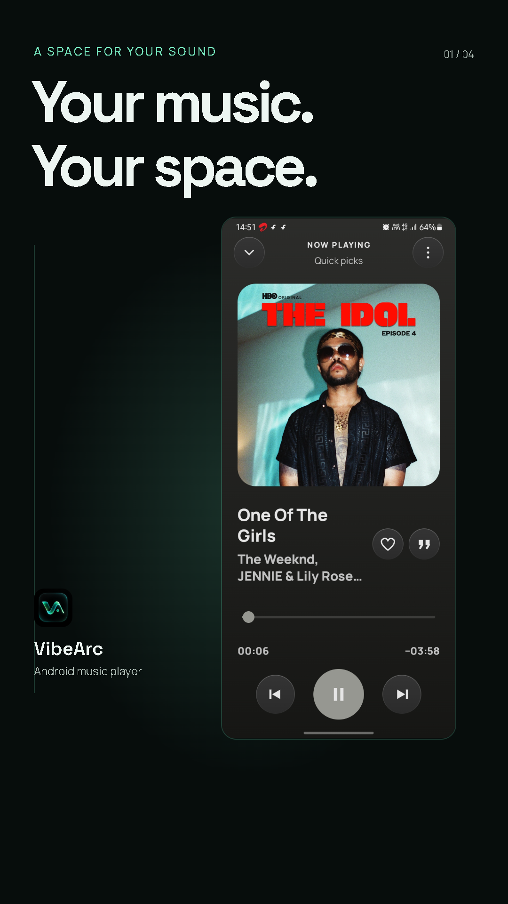
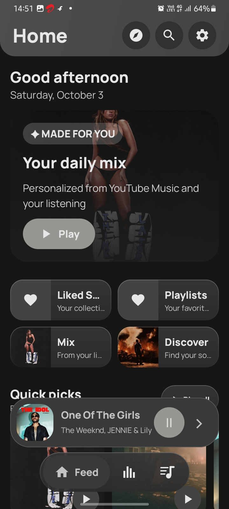
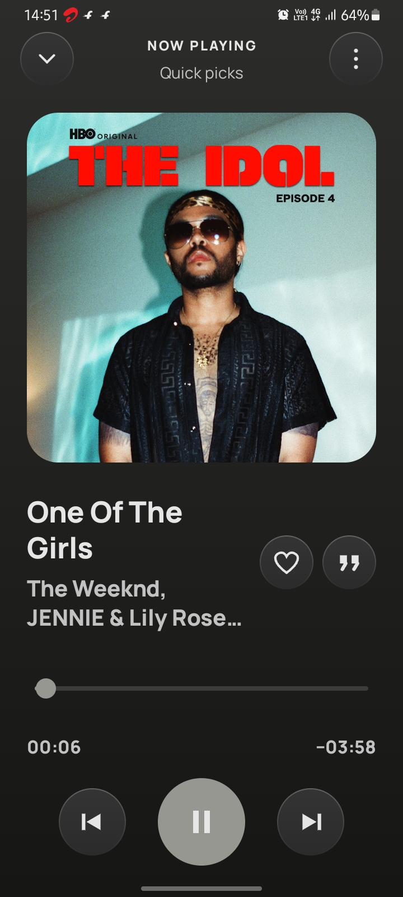
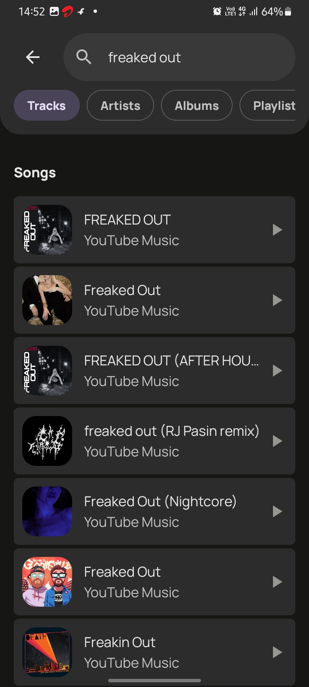
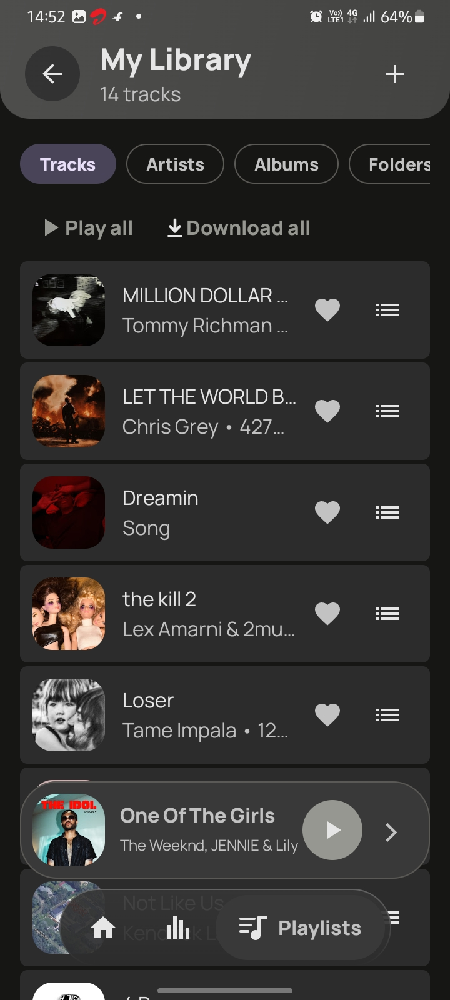
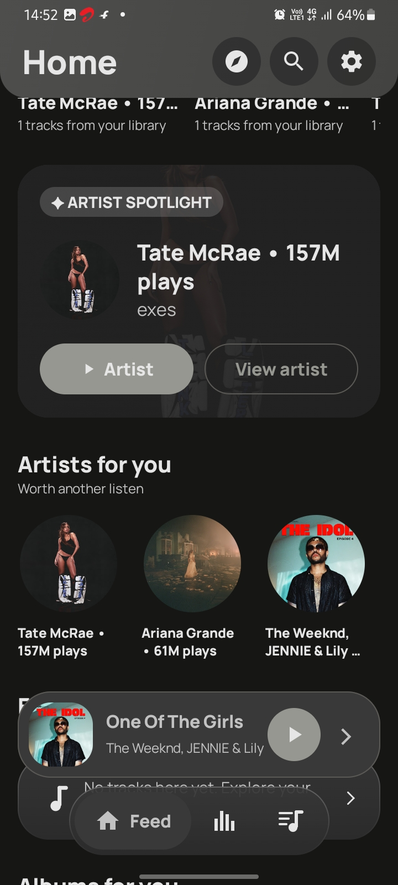
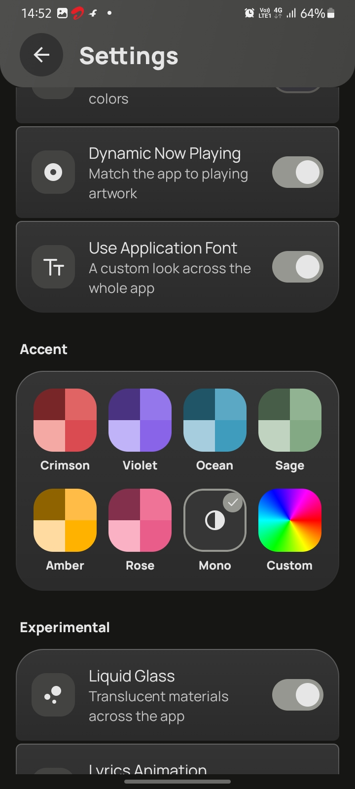
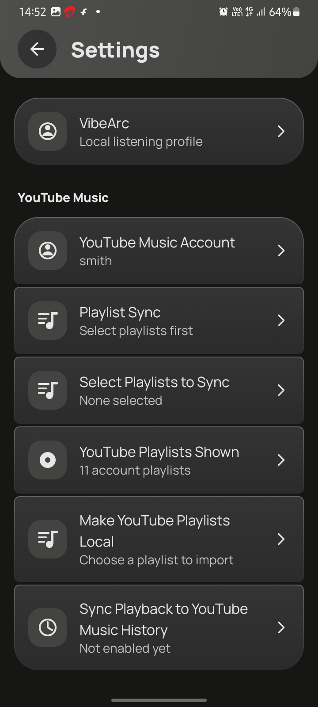
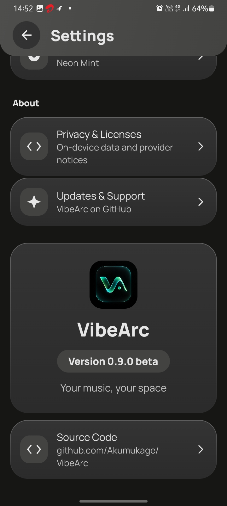

<div align="center">



# VibeArc

**Your music, your space.**

A native Android music player with liquid glass, artwork-driven colors, synchronized lyrics, and optional YouTube Music & Last.fm connections.

<p align="center">
  <a href="https://github.com/smithcooks/VibeArc/stargazers"></a>
  <a href="https://github.com/smithcooks/VibeArc/forks"></a>
  <a href="#connected-features"></a>
  <a href="#connected-features"></a>
  <a href="#getting-started"></a>
</p>

<p align="center">
  <a href="https://github.com/smithcooks/VibeArc/releases/tag/v1.4.0"></a>
  <a href="#tech-stack--architecture"></a>
  <a href="LICENSE"></a>
</p>

<p align="center">
  <a href="https://github.com/smithcooks/VibeArc/releases/download/v1.4.0/VibeArc-v1.4.0.apk"></a>
  <a href="https://smithcooks.github.io/VibeArc/"></a>
  <a href="https://github.com/smithcooks/VibeArc/issues"></a>
</p>

<p align="center">
  <a href="https://buymeachai.ezee.li/Smith_cooks"></a>
  &nbsp;
  <a href="https://github.com/sponsors/smithcooks"></a>
</p>

<sub>Support is optional. GitHub Sponsors is not active yet; its button currently opens Smith’s GitHub profile.</sub>

</div>

<br>

## Watch VibeArc in motion

<a href="https://smithcooks.github.io/VibeArc/#promo"></a>

A 30-second cinematic look at the real app. [Watch in your browser](https://smithcooks.github.io/VibeArc/#promo) or [download the MP4](https://github.com/smithcooks/VibeArc/releases/download/v1.4.0/VibeArc-launch.mp4). This promo has no audio.

<br>

<div align="center">
  <a href="docs/screenshots/home.jpg"></a>
  <a href="docs/screenshots/player.jpg"></a>
  <a href="docs/screenshots/search.jpg"></a>
  <br><br>
  <a href="docs/screenshots/library.jpg"></a>
  <a href="docs/screenshots/discovery.jpg"></a>
  <a href="docs/screenshots/appearance.jpg"></a>
  <br><br>
  <a href="docs/screenshots/accounts.jpg"></a>
  <a href="docs/screenshots/about.jpg"></a>
  <p><sub>Screenshots captured from VibeArc v0.9 beta. Unaltered app UI; the current download is v1.4.0. Click a screenshot to view it in full.</sub></p>
</div>

<br>

##  Overview

**VibeArc** brings your collection and online discoveries into a native Android player. Large artwork, a floating mini-player, and a palette that follows your music keep listening at the center.

Built with **Kotlin, Jetpack Compose, Material 3, and Media3**, it gives you a personal library, queue, lyrics, and appearance controls without hiding them behind busy menus.

---

##  Key Features

| Icon | Feature | Highlight |
| :---: | :--- | :--- |
|  | **YouTube Music client** | Search tracks, artists, albums, and playlists; connect an account and import playlists through an experimental integration. |
|  | **Your library & queue** | Browse tracks, artists, albums, and folders. Long-press to like, queue, save to a playlist, or download. |
|  | **Last.fm connection** | Profiles, statistics, and radio with configuration; authenticated Now Playing and scrobbling require your deployed signer. |
|  | **Synchronized lyrics** | Line highlighting, timed words when supplied, manual matching/editing, timing offsets, and `.lrc` export. |
|  | **Offline downloads** | Save playable online songs using the tested playback downloader. Browse, search, filter, and export your offline collection; mobile data is allowed by default. |
|  | **Discovery & radio** | Browse mixes, artist spotlights, recommendations, and radio from available provider and listening data. |
|  | **Make it yours** | Artwork-driven accents, wallpaper colors, AMOLED mode, optional liquid glass, custom fonts, and three launcher icons. |
|  | **Playback controls** | Background playback, lock-screen controls, shuffle, repeat, sleep timer, audio tuning, and crossfade where supported. |
|  | **Backup & restore** | Export and restore local data through JSON backups; account credentials are excluded. |

---

<a id="connected-features"></a>

##  Connected Features

**YouTube Music** uses an unofficial, experimental in-app WebView session, not official Google OAuth. Cookies stay in the device’s WebView session. Supported playlist synchronization is manually reviewed and confirmed. Automatic background sync and YouTube playback-history submission are **not implemented**. Provider changes, regional restrictions, and verification challenges can interrupt access.

**Last.fm** public features need an API key or configured signer. Authenticated login, Now Playing, and scrobbling need a **deployed HTTPS signer** and browser authorization. Set these up in **Settings → Last.fm** using the [signer setup guide](server/lastfm-signer/SETUP.md). No shared secret, hosted signer, or configured account is bundled. Live authenticated submissions still need testing with your configured account.

**Lyrics** use LRCLIB, KuGou KRC, and Lyrics.ovh. Availability varies by recording; word highlighting needs word timestamps. Manual matching and offsets help when automatic results are imperfect.

<details>
<summary><strong>Downloads, audio quality, and device limitations</strong></summary>

- Download only music you own or have permission to save, and respect provider terms.
- Saved format and quality depend on the available playback source. Downloads report the actual codec; no conversion or invented lossless quality is promised.
- The 15-band equalizer uses DynamicsProcessing on supported Android 9+ devices. Audio effects depend on Android and your hardware.
- Studio Master is a tuning preset, not a quality certification. Lossless sources do not guarantee bit-perfect or Hi-Res device output.
- Discovery results depend on provider data and account setup, not guaranteed complete personalization.

</details>

---

<a id="tech-stack--architecture"></a>

##  Tech Stack & Architecture

- **Language & UI:** Kotlin · Jetpack Compose · Material 3
- **Audio engine:** AndroidX Media3 / ExoPlayer
- **Online sources:** Experimental YouTube Music client · NewPipeExtractor
- **Lyrics:** LRCLIB · KuGou KRC · Lyrics.ovh
- **Authenticated Last.fm:** Cloudflare Worker in `server/lastfm-signer/`
- **Project layout:** Android app in `app/`, launch website in `docs/`, checks in `tools/`, implementation notes in `tasks/`

---

<a id="getting-started"></a>

##  Getting Started

1. Download [**VibeArc-v1.4.0.apk**](https://github.com/smithcooks/VibeArc/releases/download/v1.4.0/VibeArc-v1.4.0.apk) from the [official release](https://github.com/smithcooks/VibeArc/releases/tag/v1.4.0).
2. Allow installation for the browser or file manager you used, then install on **Android 8.0+ (API 26)**.
3. Add local music or explore compatible online sources. Configure Last.fm separately if you want it.
4. Choose your accent, build your queue, and press play.

Export a JSON backup before updating. Version code **18** and the existing release certificate support updates over earlier main-app releases; do not uninstall or clear data first. Downloads in the separate test app stay in that app’s storage. Check the [APK SHA-256 checksum](https://github.com/smithcooks/VibeArc/releases/download/v1.4.0/VibeArc-v1.4.0.apk.sha256). Sideloading warnings may appear; VibeArc is not a Google Play listing or Play Protect certification.

**Android is available now. Windows and Linux are coming soon.**

---

##  Building from Source

Requirements: **JDK 21**, Android SDK **36**, Build Tools **36.0.0**, and the included Gradle **8.14.3** wrapper. Configure the SDK in Android Studio or an untracked `local.properties`.

```powershell
git clone https://github.com/smithcooks/VibeArc.git
cd VibeArc
.\gradlew.bat :app:assembleDebug
.\gradlew.bat :app:testDebugUnitTest :app:lintRelease
node --test server/lastfm-signer/worker.test.mjs
```

On macOS/Linux, use `./gradlew` instead of `.\gradlew.bat`. Release builds require your own untracked `keystore.properties` and keystore. Signing keys and credentials are not distributed. Node.js is needed for signer tests/tooling, not to build the app.

---

##  Community & Support

- **Website:** [Explore VibeArc](https://smithcooks.github.io/VibeArc/)
- **Updates:** [Releases](https://github.com/smithcooks/VibeArc/releases) · [Changelog](CHANGELOG.md)
- **Feedback:** [Report a bug or suggest an improvement](https://github.com/smithcooks/VibeArc/issues)
- **Support Smith:** [Buy Me a Chai](https://buymeachai.ezee.li/Smith_cooks) · [GitHub Sponsors](https://github.com/sponsors/smithcooks) (not active yet)

Include your phone model, Android version, reproduction steps, and a public song link if relevant. **Never share account cookies, session tokens, or API secrets.** Focused pull requests and device-testing feedback are welcome.

---

##  Privacy, License & Attribution

No advertising or analytics SDKs. Library and preferences stay locally; connected services receive requests for their features. Android cloud backup is disabled. Read the [privacy notice](PRIVACY.md), [GPL v3 license](LICENSE), and [third-party notices](THIRD_PARTY_NOTICES.md).

VibeArc’s UI and this README’s layout are inspired by [LastWave](https://github.com/Clash-Projects/LastWave-Native). VibeArc is an independent project, with its own screenshots, branding, and feature documentation.

> [!NOTE]
> VibeArc is not affiliated with or endorsed by Google, YouTube Music, Last.fm, or any other music service. Online integrations remain experimental. Use content only with the appropriate permission and follow provider terms. Album artwork in the screenshots belongs to its respective owners.

---

<div align="center">
  <p><b>VibeArc</b> is built with ❤️ by <a href="https://github.com/smithcooks">Smith</a>.</p>
</div>
