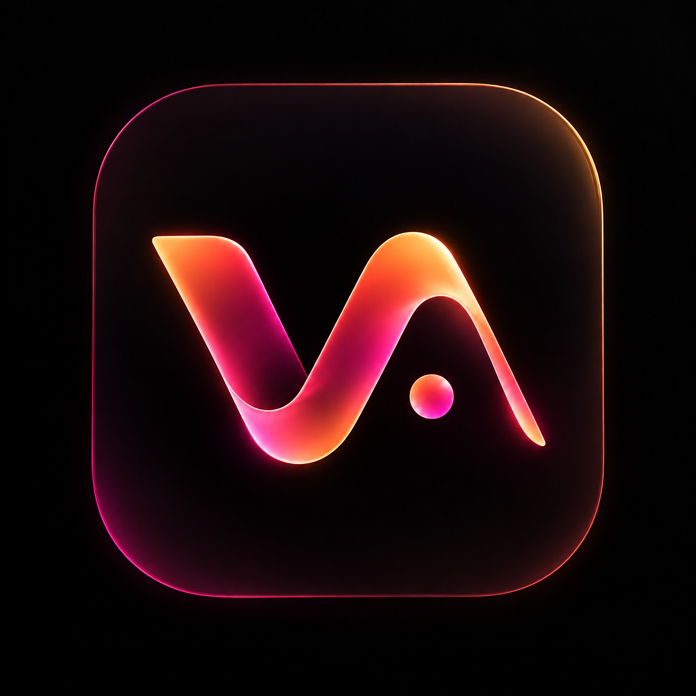
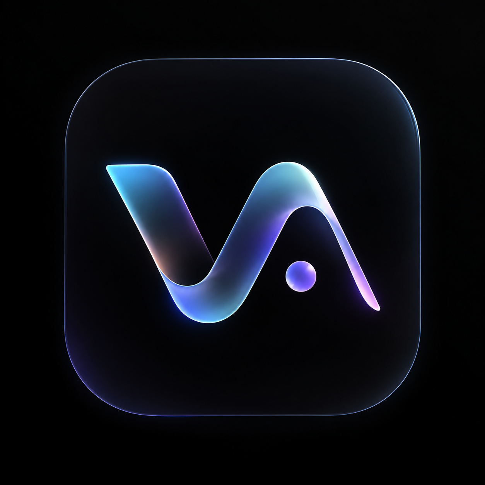

<div align="center">


# VibeArc

### Good music. No noise.

A personal Android player for your library, online discoveries, and the songs you keep coming back to.

[](https://github.com/smithcooks/VibeArc/releases/tag/v1.0.0)
[](#install)
[](#build)
[](LICENSE)

[**↓ Download APK**](https://github.com/smithcooks/VibeArc/releases/download/v1.0.0/VibeArc-v1.0.0.apk)
&nbsp; · &nbsp;
[What's new](CHANGELOG.md)
&nbsp; · &nbsp;
[**Visit the website**](https://smithcooks.github.io/VibeArc/)
&nbsp; · &nbsp;
[Report a bug](https://github.com/smithcooks/VibeArc/issues)

</div>

---

## Music first. Everything else second.

A dark, artwork-driven interface. A native player built with Kotlin, Compose,
and Media3. Keep your local collection close, discover compatible online tracks,
and move between your queue, lyrics, playlists, and Now Playing without losing your place.

| Listen your way | Make it yours |
| :--- | :--- |
| Background playback, lock-screen controls, shuffle, repeat, and sleep timer. | AMOLED black, wallpaper colors, artwork-driven colors, and custom accents. |
| Long-press songs to like, queue, add to a playlist, or download. | Optional liquid glass, wavy seek bar, and three launcher icons. |
| Local tracks, artists, albums, folders, and persistent playlists. | Synchronized lyrics, manual matching/editing, and timing offsets. |
| Selected-folder downloads and JSON backup/restore. | Built-in audio tuning and crossfade, subject to device support. |

## Connected, when you want it

**YouTube Music** — Search public music results, play compatible sources, connect
an account through the in-app WebView session, browse playlists, and import local
copies. Supported playlist synchronization is reviewed and confirmed manually.
Playback prefers your selected source codec and falls back when it is absent;
downloads require the chosen format to exist.

This integration is unofficial and experimental, not official Google OAuth.
Account cookies stay in the device's WebView session. Provider changes,
verification challenges, regional restrictions, and unavailable recordings can
interrupt access. Automatic background sync and YouTube playback-history
submission are not implemented. VibeArc is not affiliated with Google.

**Last.fm** — Public profiles, statistics, and radio need an API key or configured
signer. Authenticated login, Now Playing, and scrobbling need a deployed HTTPS
signer and browser authorization. Enter your configuration in Settings → Last.fm;
follow the [signer setup guide](server/lastfm-signer/SETUP.md).

No shared secret, hosted signer, or preconfigured account is bundled.
Automated signer tests pass; live authenticated submissions still need testing
with your configured account.

**Lyrics** — LRCLIB first, then KuGou KRC and Lyrics.ovh. Highlight the current
line, or individual words when timestamps are supplied. Manual search, editing,
offsets, and `.lrc` export help with imperfect matches. Lyrics and word timing
are not available for every recording.

## Your player, your palette

Go opaque or enable liquid glass. Choose an accent, use your wallpaper's colors,
or let the playing album shape the palette. Keep effects light on budget phones.

<div align="center">

&nbsp;&nbsp;&nbsp;

&nbsp;&nbsp;&nbsp;


Mint · Ember · Aurora
</div>

## Install

1. Download [VibeArc-v1.0.0.apk](https://github.com/smithcooks/VibeArc/releases/download/v1.0.0/VibeArc-v1.0.0.apk)
   from the [release page](https://github.com/smithcooks/VibeArc/releases/tag/v1.0.0).
2. Allow APK installation for the browser or file manager you used, then install.
3. Add your audio or explore online music. Configure Last.fm separately if wanted.

Android **8.0+ (API 26)**. Version code **12** and the existing release certificate
allow updates over v0.9 and v1.0.0-beta—do not uninstall or clear data first.
Export a JSON backup before updating.

An [APK SHA-256 checksum](https://github.com/smithcooks/VibeArc/releases/download/v1.0.0/VibeArc-v1.0.0.apk.sha256)
is included. Sideloading warnings may appear; this is not a Google Play listing
or Play Protect certification.

<details>
<summary><strong>Quality, downloads, and device limitations</strong></summary>

- Save only music you own or have permission to download; respect provider terms.
- AAC, Opus, MP3, and FLAC preferences select existing sources. The app does not
  convert unavailable formats or invent lossless audio.
- The 15-band equalizer uses DynamicsProcessing on supported Android 9+ devices.
  Effects and advanced output modes depend on Android and hardware.
- Studio Master is an audio-tuning preset, not studio-quality certification.
  A lossless source does not guarantee bit-perfect or Hi-Res device output.
- Feed, recommendation, and radio results depend on available provider data and
  account setup, not a promise of complete personalization.
- The APK is release-signed and labeled v1.0.0. Unofficial online integrations
  remain experimental.

</details>

## Build

Requirements: **JDK 21**, Android SDK platform **36**, Build Tools **36.0.0**.
The wrapper uses Gradle **8.14.3**. Configure the SDK through Android Studio or
an untracked `local.properties`.

```powershell
git clone https://github.com/smithcooks/VibeArc.git
cd VibeArc
.\gradlew.bat :app:assembleDebug
.\gradlew.bat :app:testDebugUnitTest :app:lintRelease
node --test server/lastfm-signer/worker.test.mjs
```

Release signing uses your own untracked `keystore.properties` and keystore.
Private keys and credentials are not distributed. Node.js is needed only for
signer tests/tooling, not to build the Android app.

<details>
<summary><strong>Inside the project</strong></summary>

| Area | Stack / location |
| :--- | :--- |
| Android | Kotlin · Compose · Material 3 · `app/` |
| Playback | Media3 / ExoPlayer |
| Online sources | Experimental YouTube Music client · NewPipeExtractor |
| Lyrics | LRCLIB · KuGou KRC · Lyrics.ovh |
| Authenticated Last.fm | Cloudflare Worker · `server/lastfm-signer/` |
| Tests | JVM unit tests · Node's built-in test runner |
| Notes | `docs/` · `tasks/` · [changelog](CHANGELOG.md) |

</details>

## Privacy & open source

No advertising or analytics SDKs. Library and preferences stay locally;
online services receive requests for connected features. Android cloud backup
is disabled, and JSON backups exclude account credentials.
Read the [privacy notice](PRIVACY.md) before connecting accounts.

VibeArc is inspired by LastWave's design and is an independent project.
See the [GNU GPL v3 license](LICENSE) and [third-party notices](THIRD_PARTY_NOTICES.md)
for component licenses and attribution.

## Help make it better

Report your Android version, phone model, reproduction steps, and whether a
problem affects local or online tracks. Include a public song link when useful.
**Never post account cookies, API secrets, or session tokens.**
Focused pull requests and device-testing feedback are welcome.

<div align="center">

---

**Built for listeners who want their player to feel personal.**

</div>
